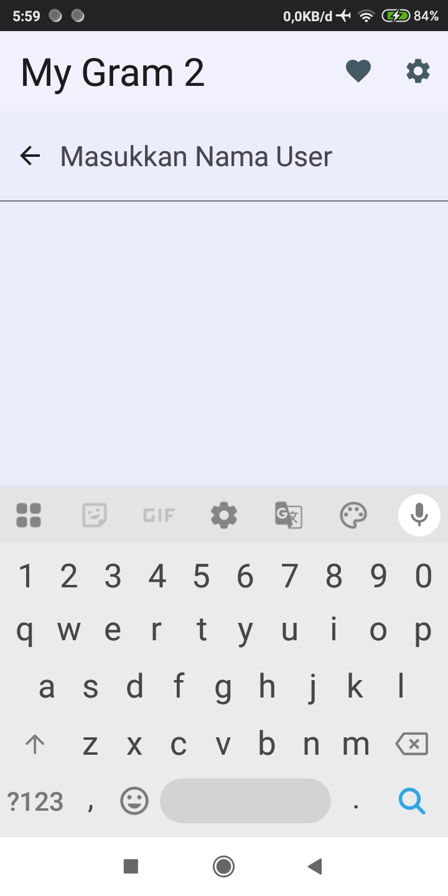

# My Gram 2 - GitHub User Search App

My Gram 2 adalah aplikasi Android yang memungkinkan pengguna untuk mencari profil pengguna GitHub, melihat detail profil, serta menyimpan pengguna favorit. Proyek ini merupakan submission untuk kelas **Belajar Fundamental Aplikasi Android** dalam program **Bangkit Academy**.

## Tampilan Aplikasi

Berikut adalah tampilan antarmuka dari aplikasi My Gram 2:

| Halaman Utama | Pencarian |
|:---:|:---:|
|  |  |

| Daftar Favorit | Mode Gelap |
|:---:|:---:|
|  |  |

## Fitur Utama

- **Pencarian Pengguna**: Cari pengguna GitHub berdasarkan username secara real-time.
- **Daftar Pengguna**: Menampilkan hasil pencarian dalam bentuk list yang rapi menggunakan RecyclerView.
- **Detail Pengguna**: Menampilkan informasi lengkap profil seperti nama, username, jumlah follower, dan jumlah following.
- **Followers & Following**: Menampilkan daftar pengikut dan yang diikuti menggunakan ViewPager2 dan TabLayout.
- **Favorit**: Pengguna dapat menambahkan atau menghapus profil dari daftar favorit yang tersimpan secara lokal menggunakan Room Database.
- **Pengaturan Tema**: Mendukung Mode Gelap (Dark Mode) dan Mode Terang (Light Mode) menggunakan DataStore Preferences.
- **Indikator Loading**: Menampilkan ProgressBar saat data sedang diambil dari API.

## Teknologi yang Digunakan

Aplikasi ini dibangun menggunakan teknologi dan library Android modern:

- **Kotlin**: Bahasa pemrograman utama.
- **MVVM (Model-View-ViewModel)**: Arsitektur aplikasi untuk memisahkan logika bisnis dan UI.
- **View Binding**: Interaksi dengan komponen UI yang lebih aman dan ringkas.
- **Retrofit & OkHttp**: Untuk networking dan konsumsi GitHub API.
- **Glide**: Library untuk pemuatan dan caching gambar (avatar user).
- **Room Database**: Untuk penyimpanan data lokal (daftar favorit).
- **DataStore Preferences**: Untuk menyimpan pengaturan tema aplikasi.
- **Coroutines & LiveData**: Menangani operasi asinkron dan data yang bersifat observable.
- **Material Design**: Untuk antarmuka pengguna yang modern dan responsif.

## API Source
Aplikasi ini menggunakan [GitHub API](https://api.github.com/). Pastikan perangkat terhubung ke internet untuk mengambil data.
